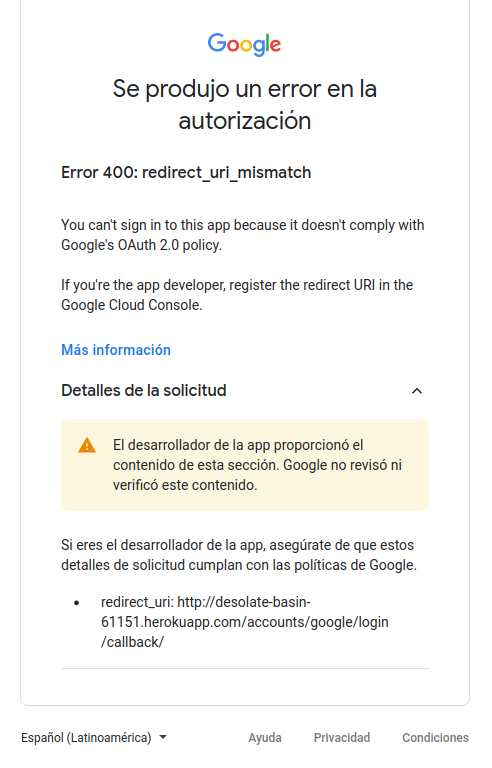

# ISII

## Link a la página en producción:
[http://desolate-basin-61151.herokuapp.com/](http://desolate-basin-61151.herokuapp.com/)

Actualmente el login por sso no funciona, el mensaje es el siguiente:



# Procedimientos a seguir para probar el entorno en local:

*OBS.: Actualmente solo Roxana puede pushear los cambios a producción, ya que la app está en su cuenta creada. Las siguientes instrucciones intentan reflejar el proceso completo para llevarlo a producción.*

## Tener instalado

- python 3.8.10
- para crear entornos virtuales
```shell
$ sudo apt-get install python3.8-venv
```
- para tener la base de datos postgresql
```shell
$ sudo apt-get install postgresql postgresql-contrib
```

En postgres se debe crear el usuario postgres con la contraseña postgres. Luego crear una base de datos llamada **desarrollo**

## Crear entorno virtual de python

```shell
$ python3 -m venv nombredelentorno
```

## Activar entorno
```shell
$ cd nombre_entorno
$ source bin/activate
```

## Descargar repositorio
Dentro de la carpeta del entorno descargar repositorio
```shell
$ git clone https://github.com/Jigaka/ISII.git
```

## Instalar los paquetes del entorno
Ingresar a la carpeta del repositorio

OBS: tener activado el entorno virtual
```shell
$ pip install -r requirements.txt 
```
(En requirements.txt se encuentran todos los componentes necesarios para trabajar con heroku)

## Probar el entorno
```shell
$ python3 manage.py makemigrations
$ python3 manage.py migrate
$ python3 manage.py runserver
```

## Instalar el cliente Heroku e iniciar sesión
```
sudo snap install heroku --classic
```

## Ingresar a heroku
```
heroku login
```

## Crear y subir el sitio
```
heroku create
```

## Establecer el buildpack de la aplicación
```
heroku buildpacks:set heroku/python
```

## Hacer push al entorno de producción
```
git push heroku main
```

Si el push genera algún fallo relacionado a que la rama no está especificada, probar el siguiente comando:
```
git push heroku despliegue-produccion:main
```

## Hacer las migraciones
```
heroku run python manage.py makemigrations
heroku run python manage.py migrate
```

## Podemos mirar el sitio con este comando
```
heroku open
```